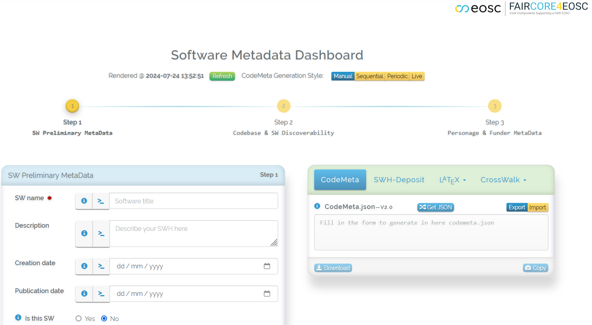
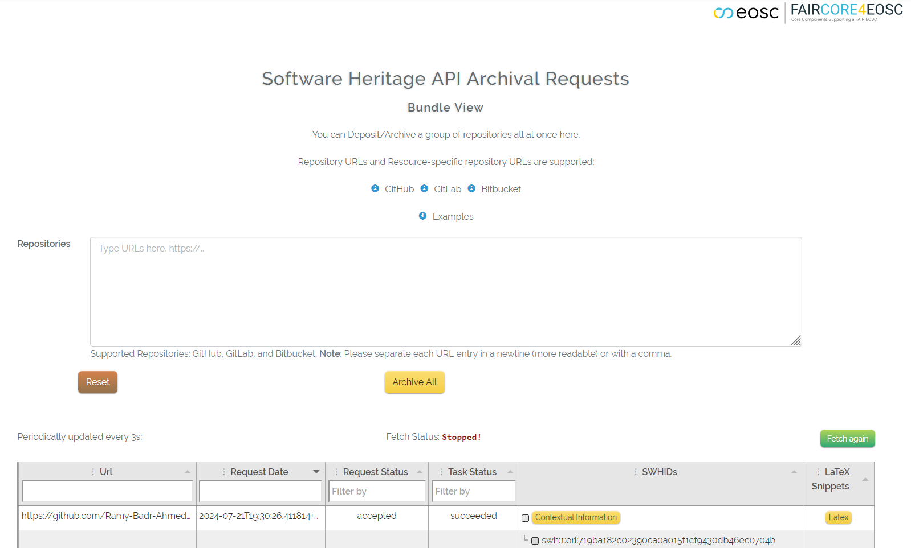

# beta-faircore4eosc

  

> [!Note]
>  A demonstrable version can be accessed here: <a href="https://1959e979-c58a-4d3c-86bb-09ec2dfcec8a.ka.bw-cloud-instance.org/" target="_blank">**Demo Version**</a>

#### Sample snapshot of the codemeta generator and converter demo:

#### Sample archiving repositories demo:

## Installation Steps:

    1) Clone this project.
    
    2) Open a console session and navigate to the cloned directory, then:
    
        2.1) Run "composer install".
        
        2.2) Run "npm install".         
        
    3) (Optional) Create your local branch.
    
    4) (Optional) Acquire SWH tokens for increased SWH-API Rate-Limits.
    
    5) Prepare .env file:   
    
        5.1) Rename/Copy the cloned ".env.example" file
                cp .env.example .env   
                
        5.2) ADD these Keys:
        
                SWH_TOKEN=Your_TOKEN_FROM_SWH_ACCOUNT                   # As set in step 4)                
                SWH_API_URL=https://archive.softwareheritage.org                
                SWH_TOKEN_STAGING=Your_STAGING_TOKEN_FROM_SWH_ACCOUNT   # As set in step 4)                
                SWH_API_URL_STAGING=https://webapp.staging.swh.network

    You can now proceed to either I) or II)

#### I) SWH API First Steps:

    1) In a console session inside the cloned directory.    
    
        - Run 'php artisan tinker' to interact with the API modules.
        
    2) Initialise a new API session:
    
        - Write:
                namespace App\Modules\SwhApi;                 
                use App\Modules\SwhApi;
                
> - You can now proceed to the [SWH API Client documentation](https://github.com/Ramy-Badr-Ahmed/beta-faircore4eosc/blob/dev-cont/app/Modules/SwhApi/README.md)
> - SWH Client as a standalone php library: https://github.com/Ramy-Badr-Ahmed/swh-client/wiki
___

#### II) Deployment Steps (Run your own local webserver instance):
    
    1) Setup a Database (e.g. MariaDB/MySQL/PostgreSQL) and create a new DB schema relevant for this project.
    
    2) Edit .env file
    
        2.1) (Optional) Generate an Application Key --> Navigate to the cloned directory and Run "php artisan key:generate"
        
        2.2) Edit Keys:
                APP_NAME=beta-faircore4eosc
                APP_ENV=local 
                APP_DEBUG=true
                APP_URL=http://localhost

                DB_CONNECTION=mysql             # As set in step 1)
                DB_HOST=127.0.0.1               # As set in step 1)
                DB_PORT=3306                    # As set in step 1)
                DB_DATABASE=beta-faircore4eosc  # As set in step 1): Name of your database schema for this project
                DB_USERNAME=root                # As set in step 1)
                DB_PASSWORD=                    # As set in step 1)

    3) Run "php artisan migrate".    
    
    4) (Optional) Checkout the first Commit: "Initial Setup".
    
    5) Navigate to the cloned directory and Run "php artisan serve" in your console.     
    
    6) Visit "http://127.0.0.1:8000" from your browser.

#### III) Quick Test After II) Deployment:

    1) Navigate to an Archive page, e.g.: /beta/archival-view-3
    
    2) Insert a group of repository URLs.
    
    3) Navigate to the previously cloned directory and then Run "php artisan swh:updateCron" in your console to synchronise with SWH.
    
       Note: you may need to set up a CRON/Scheduler in your OS.
